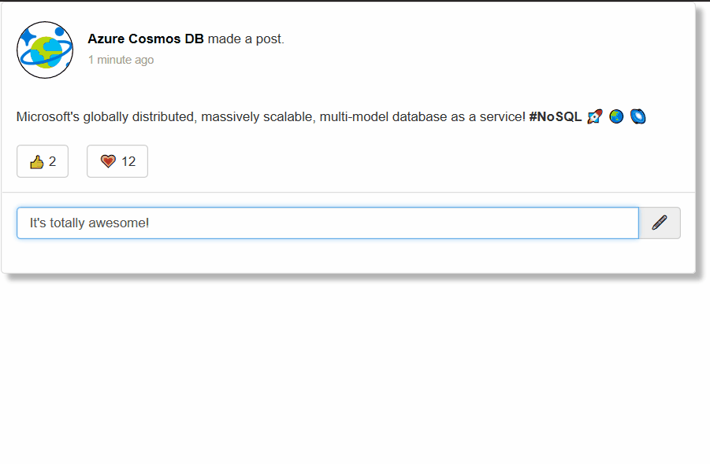

# Serverless recipes with the Azure Cosmos DB Trigger
[<- Back to the root](../README.md)

The following project contains a sample project showcasing the use of the [Cosmos DB Trigger](https://docs.microsoft.com/azure/azure-functions/functions-bindings-cosmosdb#trigger) to work with data as it's inserted/modified in a Cosmos DB container. 

This reusable solution creates a complete serverless scenario for a social application that stores data in a Cosmos DB container, uses Functions for hosting and event processing, [Azure Cognitive Services](https://azure.microsoft.com/services/cognitive-services/) for content analysis, and [Azure SignalR](https://docs.microsoft.com/azure/azure-signalr/signalr-overview) for websocket client messaging.

The solution contains a group of Functions:

* Azure Functions as a [serverless Web host](./src/Functions/FileServer.cs) for static html/js/css files (the social UI). 
* Azure Functions [HTTP API](./src/Functions/SavePost.cs) to receive client calls to store data in Azure Cosmos DB using the [Output Binding](../cosmosdboutputbindings/README.md).
* Azure Functions [CosmosDB Trigger](./src/Functions/CosmosDBAnalyticsTrigger.cs) that takes new social posts, send them to Cognitive Services using a [static client](../cosmosdbstaticclient/README.md), and distributing the result to all Signal R connected clients.
* The [web client](./src/www/index.html) is using [Azure SignalR's npm package](https://www.npmjs.com/package/@aspnet/signalr) for connectivity and transport protocol resolution.
* Another Azure Functions [HTTP API](./src/Functions/SignalRConfiguration.cs) that will send the required information to the Web client to initialize SignalR Websocket connection.

In order to support custom routes (particularly for the static Web host), it implements [Azure Functions Proxies](https://docs.microsoft.com/azure/azure-functions/functions-proxies) through a [proxies.json](./src/proxies.json) file. So when browsing the base URL, it is instead calling one of the HTTP triggered Functions.

1. When the Web client loads the static resources, it pulls the SignalR configuration from [SignalRConfiguration](./src/Functions/SignalRConfiguration.cs).
2. It will then negotiate with Azure SignalR the best transport protocol.

3. When the user writes a post, it will save it to Azure Cosmos DB via an Ajax call to [SavePost](./src/Functions/SavePost.cs)

4. The [CosmosDBAnalyticsTrigger](./src/Functions/CosmosDBAnalyticsTrigger.cs) will trigger and broadcast it to all Azure SignalR connected clients.

## How to run this sample

You can use Visual Studio Code, Visual Studio or even the [Azure Functions' CLI](https://github.com/Azure/azure-functions-core-tools). You only need to customize the [local.settings.json](./src/local.settings.json) file to match the Cosmos DB *Connection String*, *Database name*, and *Collection/Container name* on which you want the posts to be saved. You also need an Azure Signal R *Connection String* and the *Key* to a [Cognitive Services Text Analytics API](https://docs.microsoft.com/azure/cognitive-services/text-analytics/how-tos/text-analytics-how-to-access-key).

>Additional step: Change the Region of your Cognitive Services deployment [here](./src/Functions/CosmosDBAnalyticsTrigger.cs#L28).

Once the solution is running, open your browser in the base address informed by the Azure Function's runtime (something along the lines of `http://localhost:<some-port>`).

## Useful links

* [Azure Cosmos DB + Functions Cookbook — multi trigger](https://medium.com/@Ealsur/azure-cosmos-db-functions-cookbook-multi-trigger-f8938673de57)
* [Azure Cosmos DB + Functions Cookbook — search indexing](https://medium.com/@Ealsur/azure-cosmos-db-functions-cookbook-search-indexing-7059b7faa73f)
* [Azure Cosmos DB + Functions Cookbook — live migration](https://medium.com/@Ealsur/azure-cosmos-db-functions-cookbook-live-migration-18ca3e60fda1)
* [More Cosmos DB Trigger samples](https://docs.microsoft.com/azure/azure-functions/functions-bindings-cosmosdb#trigger---example)